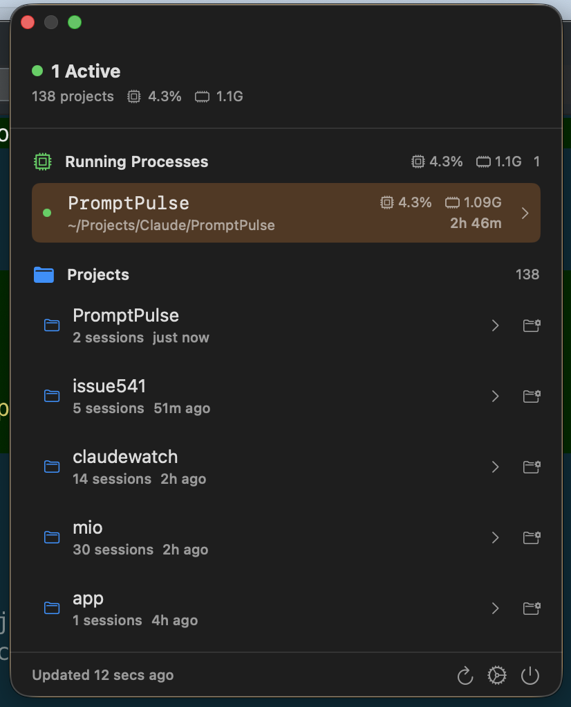
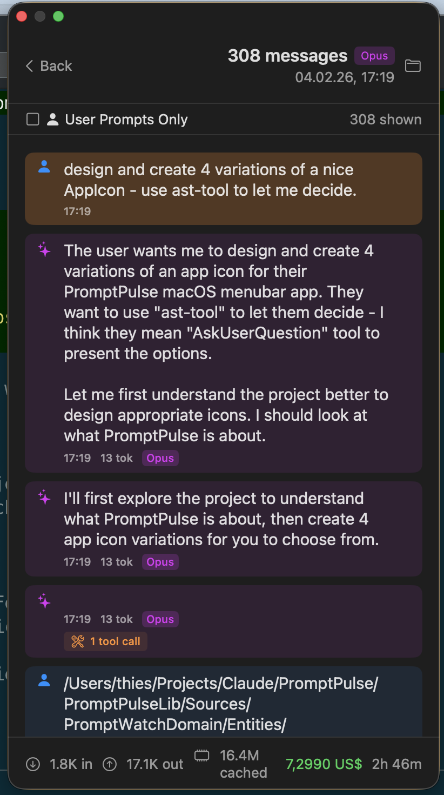

<p align="center">
  
</p>

<h1 align="center">PromptPulse</h1>

<p align="center">
  <strong>A macOS menubar app for monitoring Claude Code CLI sessions</strong>
</p>

<p align="center">
  <a href="https://github.com/thieso2/PromptPulse/actions/workflows/ci.yml">
    
  </a>
  <a href="https://github.com/thieso2/PromptPulse/releases/latest">
    
  </a>
  
  
</p>

<p align="center">
  <em>🤖 100% generated by Claude (Opus 4.5) — code, icons, documentation, and CI/CD</em>
</p>

---

## Screenshots

<p align="center">
  
  
</p>

## Features

- **📊 Live Process Monitoring** — View active Claude Code processes with CPU and memory usage
- **📁 Session History** — Browse all Claude sessions organized by project
- **💬 Message Viewer** — Read full conversation history with token stats and cost estimates
- **🎯 User Prompts Filter** — Focus on just user inputs with drill-down to see Claude's work
- **⌨️ Keyboard Navigation** — Full keyboard support (arrows, return, escape)
- **🎨 Customizable** — Adjustable font size, theme (light/dark/system), and display options
- **📈 Status Indicator** — Color-coded menubar icon (green/yellow/orange/red) based on system load

## Installation

### Homebrew (Recommended)

```bash
brew install thieso2/tap/promptpulse
```

### Direct Download

1. Go to [Releases](https://github.com/thieso2/PromptPulse/releases/latest)
2. Download `PromptPulse-x.x.x-macOS.zip`
3. Extract and drag to `/Applications`
4. Open PromptPulse — it appears in your menubar

> **Note:** The app is signed and notarized by Apple, so it opens without security warnings.

### Build from Source

```bash
# Install mise (if not already installed)
curl https://mise.run | sh

# Clone and build
git clone https://github.com/thieso2/PromptPulse.git
cd PromptPulse
mise install tuist
mise exec -- tuist generate --no-open
mise exec -- tuist xcodebuild build -scheme PromptPulse -configuration Release
```

## Usage

1. Click the PromptPulse icon in your menubar
2. View active Claude Code sessions and their resource usage
3. Click a project to see session history
4. Click a session to view the full conversation
5. Press `U` to toggle user-prompts-only filter

### Keyboard Shortcuts

| Shortcut | Action |
|----------|--------|
| `⌘,` | Open Settings |
| `⌘R` | Refresh |
| `↑/↓` | Navigate items |
| `Return` | Activate/drill-down |
| `Escape` | Go back |
| `U` | Toggle user prompts filter |

## Requirements

- macOS 15.0 (Sequoia) or later
- [Claude Code CLI](https://claude.ai/code) installed and used at least once

## Architecture

```
PromptPulse/
├── PromptPulse/              # SwiftUI macOS app
│   ├── App/                  # AppDelegate, main entry point
│   ├── Views/                # SwiftUI views
│   ├── State/                # AppState, AppSettings
│   └── Resources/            # Assets, icons
└── PromptPulseLib/           # Swift package with domain logic
    ├── PromptWatchKit/       # Main facade, public API
    ├── PromptWatchData/      # Data layer (parsers, repositories)
    ├── PromptWatchDomain/    # Domain models, business logic
    └── PromptWatchPlatform/  # Platform-specific code (process monitoring)
```

## About This Project

This project was **100% generated by Claude** (Opus 4.5) using [Claude Code](https://claude.ai/code):

- ✅ All Swift/SwiftUI code
- ✅ App icons (4 variations designed, 1 selected)
- ✅ Project structure and architecture
- ✅ GitHub Actions CI/CD pipelines
- ✅ Code signing and notarization setup
- ✅ Documentation

No human-written code. Just prompts and iteration.

## License

MIT

---

<p align="center">
  Made with 🤖 by <a href="https://claude.ai">Claude</a>
</p>
